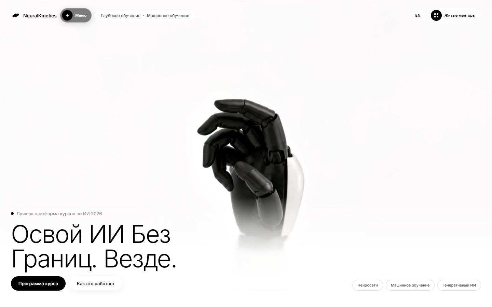
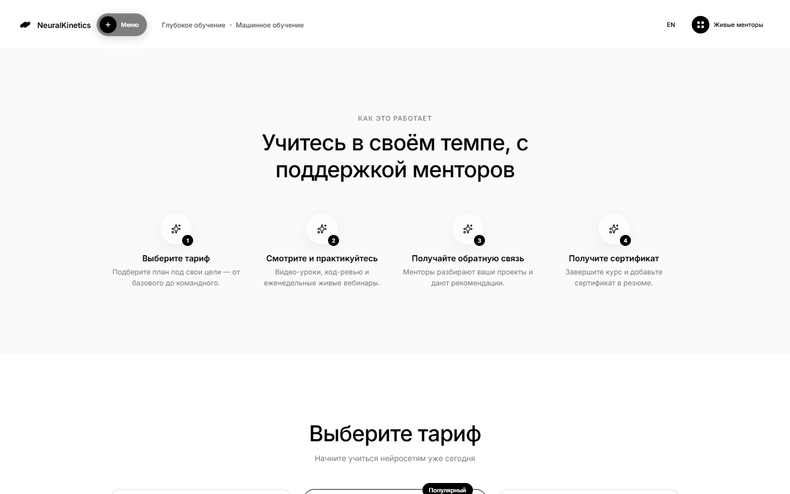
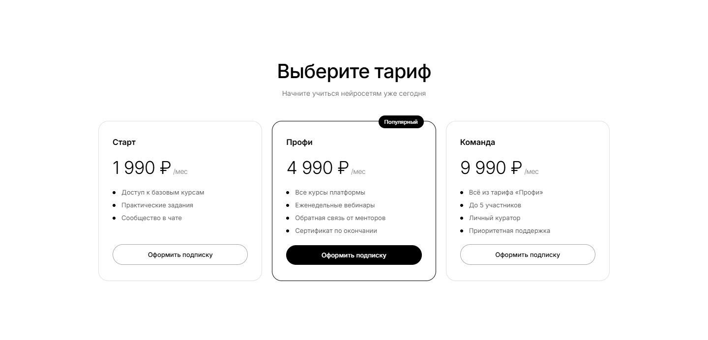

# NeuralKinetics

A minimalist black-and-white landing page selling an AI / neural networks course — built with React, Vite and Framer Motion (`motion`). Bilingual (RU/EN), with a mock registration + subscription checkout flow.

**🔴 Live demo:** https://bringto-dot.github.io/ai-sales-landing/

🇷🇺 [Русский](#русский) · 🇬🇧 [English](#english)

---

## English

Full-viewport hero with a looping background video, a liquid-glass navbar with a working dropdown menu, a course program section, a "how it works" section with scroll-triggered animations, and a pricing/subscription section with a demo registration + checkout modal. Language toggle (RU ⇄ EN) persists across visits.



The hero includes a live language switcher, a glass-styled navbar menu with links to every section, and two CTAs that jump to different parts of the page.



A four-step "how it works" section with staggered reveal-on-scroll animations, sitting between the course program and the pricing table.



Three subscription tiers, each opening a demo sign-up → payment → success modal. **No real payment gateway is wired up** — the checkout form is a front-end mock; card details are never sent or stored anywhere.

### Tech stack

- React 19 + Vite
- `motion` (Framer Motion) for animations
- Plain CSS (no UI framework)
- `lucide-react` for icons

### Run locally

```bash
npm install
npm run dev
```

### Deployment

Pushing to `main` triggers a GitHub Actions workflow (`.github/workflows/deploy.yml`) that builds the app and publishes it to GitHub Pages.

---

## Русский

Полноэкранный хиро-блок с зацикленным фоновым видео, навбар в стиле «жидкого стекла» с рабочим выпадающим меню, секция программы курса, секция «как это работает» с анимациями при прокрутке и секция тарифов с демо-формой регистрации и оплаты подписки. Переключатель языка (RU ⇄ EN) сохраняется между визитами.


На главном экране — переключатель языка, стеклянное меню со ссылками на все секции и две кнопки, ведущие в разные части страницы.


Секция из четырёх шагов с анимацией появления при прокрутке — между программой курса и тарифами.


Три тарифных плана, каждый открывает демо-форму: регистрация → оплата → успех. **Реального платёжного шлюза нет** — форма оплаты имитационная, данные карты никуда не отправляются и не сохраняются.

### Стек технологий

- React 19 + Vite
- `motion` (Framer Motion) для анимаций
- Обычный CSS (без UI-фреймворков)
- `lucide-react` для иконок

### Запуск локально

```bash
npm install
npm run dev
```

### Деплой

При пуше в `main` запускается GitHub Actions (`.github/workflows/deploy.yml`), который собирает проект и публикует его на GitHub Pages.
