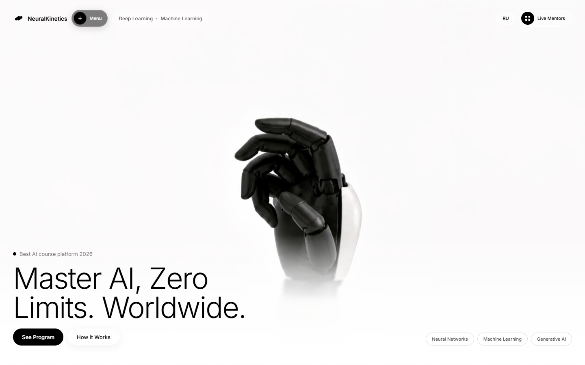
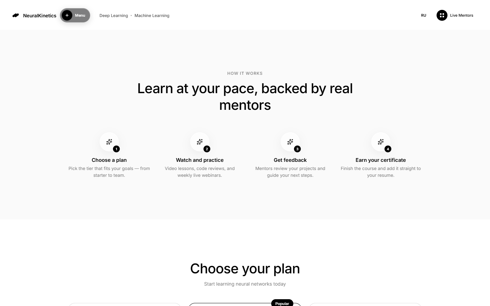
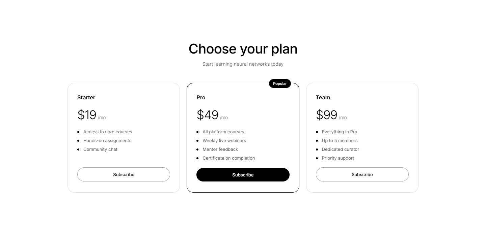

# NeuralKinetics

**Language:** 🇬🇧 [English](README.md) · 🇷🇺 [Русский](README.ru.md)


**[Live Demo](https://bringto-dot.github.io/ai-sales-landing/)**



A single-page sales landing for an AI course, built around a monochrome
visual system, full-screen video, glass UI, and scroll-driven interaction.

The page is designed as a complete sales journey rather than a collection
of sections: the visual hero introduces the product, the program explains
what the course contains, pricing leads into registration, and the
checkout flow completes the interaction on the front end.

The course, mentors, and curriculum are fictional. The hero video is real
stock footage used as visual content for the portfolio project.

## Visual direction

The interface uses a restrained black-and-white palette with large
typography, generous negative space, translucent surfaces, and a
full-viewport video hero.

The glass effect is intentionally limited to selected interface elements.
Navigation pills, the mobile menu, and specific cards use blur, saturation,
and inset highlights to create depth without turning the entire page into
a collection of frosted panels.

## The landing experience

The page follows a simple progression:

Hero → Program → How it works → Pricing → Signup

Each section has a clear role in the sales flow while keeping the same
visual language throughout the page.

The hero combines looping video, navigation, headline content, and
supporting information in a single viewport. The program section then
moves from visual impact toward concrete course information, while
pricing provides the transition into the interactive signup flow.

## Motion as part of the interface

Animation is used to support the structure of the page rather than simply
decorate it.

Program cards respond to scroll position with a controlled tilt and scale
effect. The steps section uses staggered reveal animations as its content
enters the viewport.



The navigation menu has its own small interaction: the trigger morphs from
a `+` into an `×` when opened.

These interactions are implemented with `motion` and its scroll utilities,
keeping the animation behavior close to the components that use it.

## Pricing and checkout

The pricing cards open a multi-step modal flow:

Registration → Payment → Success

The form includes client-side validation and keeps the user inside the
same visual system as the landing page.

The checkout is intentionally simulated on the front end. There is no
backend or payment processor connected, and card information is neither
transmitted nor stored.



## Localization

The landing page supports Russian and English through a custom translation
layer.

All interface strings are stored in a shared dictionary under
`src/i18n/translations.js`. A context provider controls the active
language, while the selected locale is persisted in `localStorage`.

Switching the language updates the page without requiring a separate route
or duplicate page implementation.

## Responsive behavior

The hero is built around a full-viewport composition that keeps the
navigation, background video, and content block independent from each
other.

This allows the main visual structure to remain stable across different
viewport heights instead of relying on one fixed desktop composition.

The remaining sections use responsive layouts that adapt their spacing,
card arrangement, navigation, and typography to smaller screens.

## Front-end structure

The project keeps the main page sections and shared concerns separated
into focused React components.

```text
src/
├── assets/
├── components/
├── i18n/
├── App.jsx
├── index.css
└── main.jsx
```

The components contain the page sections and interactive elements, while
localization is kept in its own module rather than being mixed directly
into the UI.

The project does not rely on Tailwind or a component library. Styling is
implemented with plain CSS, giving the visual system direct control over
layout, glass effects, typography, and responsive behavior.

## Technical foundation

The project uses:

- React 19 for the interface
- Vite for development and production builds
- Motion for scroll-linked and interface animations
- Lucide React for icons
- plain CSS for the visual system
- a custom RU/EN translation layer for localization

## Deployment

The project is deployed to GitHub Pages.

Changes pushed to `main` trigger a GitHub Actions workflow that builds the
application and publishes the resulting `dist` directory.

The Vite configuration uses the `/ai-sales-landing/` base path required
for the GitHub Pages deployment.

## Project scope

NeuralKinetics is a portfolio concept rather than a real course platform.

The product content, mentors, and curriculum are fictional. The signup and
payment sequence demonstrates the intended front-end interaction, while
the actual payment processing and data persistence are outside the scope
of the project.

## Result

NeuralKinetics focuses on the part of a sales landing page that users
experience first: visual hierarchy, motion, interaction, and the
transition from product presentation to conversion.

The result combines a full-screen video hero, restrained glass UI,
scroll-based motion, bilingual content, responsive layouts, and a complete
simulated signup-to-checkout flow in a single-page interface.
